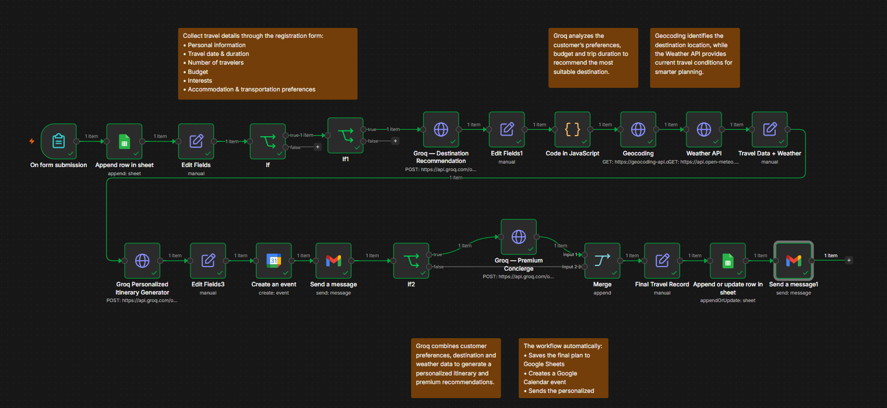
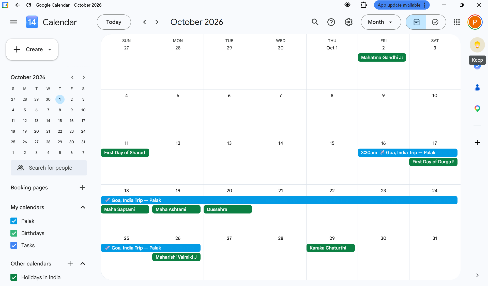
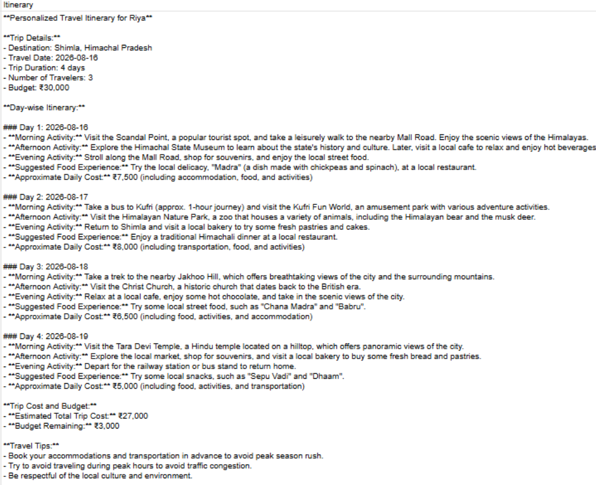
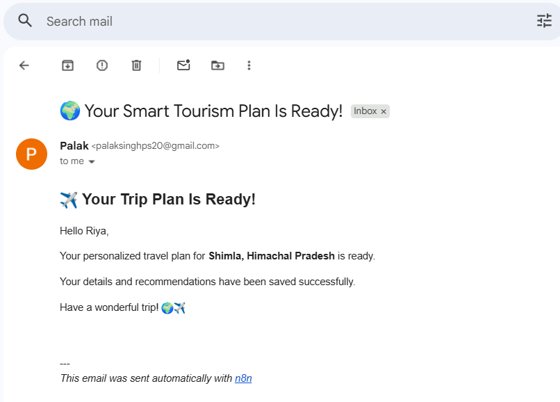

# 🌍 Smart Tourism Travel Planning Automation

An AI-powered travel planning automation system built using **n8n, Groq, Google Sheets, Google Calendar, Gmail, Geocoding API, Weather API, and JavaScript**.

The system collects customer travel preferences, recommends a suitable destination using AI, retrieves location and weather information, generates a personalized itinerary, creates a calendar event, stores the final record, and sends the travel plan through email.

---

## 🎯 Problem Statement

Traditional travel planning involves several manual tasks:

- Collecting customer requirements
- Selecting suitable destinations
- Checking weather conditions
- Creating itineraries
- Maintaining customer records
- Scheduling trips
- Sending personalized travel plans

This project automates these activities using an AI-powered n8n workflow.

---

## 💡 Solution

The complete workflow is:

**Customer Registration → Data Processing → AI Recommendation → Geocoding → Weather API → Personalized Itinerary → Google Calendar → Premium Recommendations → Google Sheets → Gmail**

---

## 🚀 Key Features

- 📝 Automated travel registration
- 🤖 AI-powered destination recommendation using Groq
- 🧠 Personalized itinerary generation
- 🌍 Destination geocoding
- 🌦️ Weather API integration
- 📊 Google Sheets data storage
- 📅 Google Calendar event creation
- 📧 Automated Gmail notification
- 💎 Premium travel recommendations
- 🔀 Conditional branching using IF nodes
- 💻 JavaScript data processing

---

## 🏗️ Workflow Architecture

### 1. Customer Registration

The customer provides:

- Full Name
- Email
- Phone Number
- Travel Date
- Number of Travelers
- Budget
- Trip Duration
- Travel Interests
- Accommodation Preference
- Transportation Preference

### 2. AI Destination Recommendation

Groq analyzes the customer's:

- Budget
- Trip duration
- Number of travelers
- Interests
- Accommodation preference
- Transportation preference

and recommends a suitable destination.

### 3. Destination & Weather Enrichment

The recommended destination is processed using:

- **Geocoding API** — retrieves location information
- **Weather API** — retrieves weather information

### 4. Personalized Itinerary

Groq generates a personalized day-wise travel plan containing:

- Activities
- Food recommendations
- Estimated costs
- Travel tips
- Weather precautions
- Packing suggestions

### 5. Final Automation

The workflow automatically:

- Creates a Google Calendar event
- Stores the final travel record in Google Sheets
- Generates premium recommendations
- Sends a personalized Gmail

---

## 🛠️ Technology Stack

| Technology | Purpose |
|---|---|
| **n8n** | Workflow automation |
| **Groq / Llama 3.3 70B** | AI recommendations and itinerary |
| **Google Sheets** | Customer and travel data storage |
| **Google Calendar** | Trip scheduling |
| **Gmail** | Automated communication |
| **Geocoding API** | Destination location data |
| **Weather API** | Weather information |
| **JavaScript** | Data transformation |
| **GitHub** | Version control and documentation |

---

## 📊 Example

### Customer Input

- Travelers: 3
- Budget: ₹40,000
- Duration: 10 days
- Interests: Beaches, Cafe, Sunset
- Accommodation: 5 Star
- Transportation: Train

### Generated Output

**Destination:** Goa, India

The system generates:

- Personalized itinerary
- Weather information
- Estimated trip cost
- Travel tips
- Premium recommendations
- Google Calendar event
- Google Sheets record
- Personalized Gmail

---
## 📸 Screenshots

### Complete n8n Workflow



### Google Calendar



### Personalized Itinerary



### Gmail Output



---

## 🎥 Project Demo

### Smart Tourism Automation Demo

[▶️ Watch the Demo Video](YOUR_VIDEO_LINK_HERE)

The demo covers:

1. Customer registration
2. AI destination recommendation
3. Geocoding and weather APIs
4. Personalized itinerary generation
5. Google Calendar automation
6. Google Sheets storage
7. Gmail notification
8. Premium recommendations

---

## 📁 Repository Structure

```text
smart-tourism-n8n/
│
├── workflows/
│   └── Smart-Tourism-Travel-Registration-PUBLIC.json
│
├── screenshots/
│   ├── n8n-workflow.png
│   ├── google-sheets.png
│   ├── google-calendar.png
│   ├── personalized-itinerary.png
│   └── confirmation-email.png
│
├── docs/
│   └── project-report.pdf
│
└── README.md
