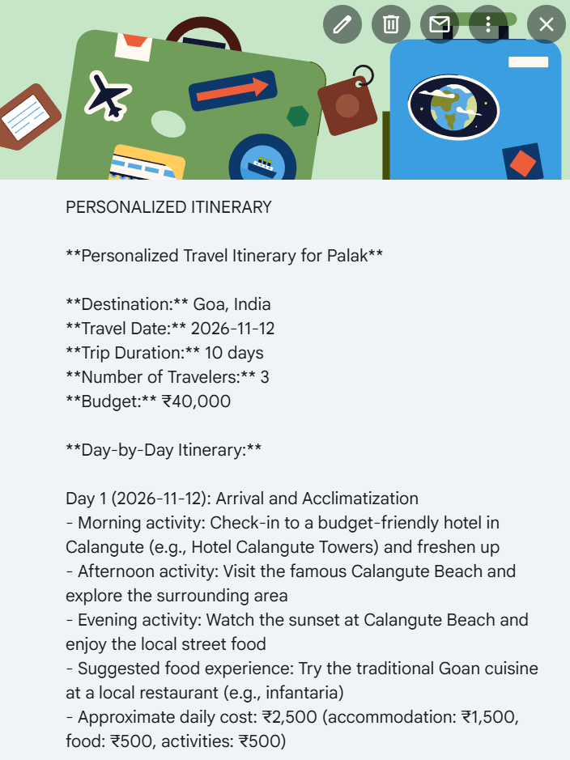

# 🌍 Smart Tourism Travel Planning Automation

An AI-powered travel planning automation system built using **n8n, Groq, Google Sheets, Google Calendar, Gmail, Geocoding API, Weather API, and JavaScript**.

The system collects customer travel preferences, recommends a suitable destination using AI, retrieves location and weather information, generates a personalized itinerary, creates a calendar event, stores the final record, and sends the travel plan through email.

---

## 🎯 Problem Statement

Traditional travel planning involves several manual tasks:

- Collecting customer requirements
- Selecting suitable destinations
- Checking weather conditions
- Creating itineraries
- Maintaining customer records
- Scheduling trips
- Sending personalized travel plans

This project automates these activities using an AI-powered n8n workflow.

---

## 💡 Solution

The complete workflow is:

**Customer Registration → Data Processing → AI Recommendation → Geocoding → Weather API → Personalized Itinerary → Google Calendar → Premium Recommendations → Google Sheets → Gmail**

---
---

## 🔄 System Data Flow

```text
Customer
   ↓
Travel Registration Form
   ↓
Customer Data Processing
   ↓
Google Sheets
   ↓
Groq AI
   ↓
Destination Recommendation
   ↓
Geocoding API
   ↓
Weather API
   ↓
Personalized Itinerary
   ↓
Premium Recommendations
   ↓
Google Calendar
   ↓
Final Travel Record
   ↓
Gmail

## 🚀 Key Features

- 📝 **Automated Travel Registration**  
  Collects customer travel details through an automated registration form.

- 🤖 **AI-Powered Destination Recommendation**  
  Uses Groq AI to recommend suitable destinations based on budget, duration, interests, and travel preferences.

- 🧠 **Personalized Itinerary Generation**  
  Generates customized day-wise travel plans based on customer requirements.

- 🌍 **Destination Geocoding**  
  Retrieves geographical information such as latitude, longitude, and location details.

- 🌦️ **Weather Integration**  
  Retrieves destination weather information to improve travel planning.

- 💎 **Premium Travel Recommendations**  
  Provides recommendations for premium hotels, restaurants, transportation, and experiences.

- 📊 **Google Sheets Automation**  
  Automatically stores customer information and generated travel records.

- 📅 **Google Calendar Automation**  
  Creates a travel event containing the customer's trip details and itinerary.

- 📧 **Automated Gmail Communication**  
  Sends a personalized travel plan directly to the customer.

- 🔀 **Conditional Workflow Branching**  
  Uses IF nodes to control workflow decisions and processing paths.

- 💻 **JavaScript Data Processing**  
  Processes, transforms, and formats data between different workflow stages.

- 🔗 **Multi-API Integration**  
  Connects AI, weather, geocoding, Google Workspace, and automation services into one workflow.

## 🏗️ Workflow Architecture

The Smart Tourism system is implemented as an end-to-end **n8n automation workflow** that connects customer input, AI processing, external APIs, data storage, scheduling, and communication.

### 🔄 Overall Workflow

```text
Customer
   ↓
Travel Registration Form
   ↓
Data Processing
   ↓
Google Sheets
   ↓
Groq AI
   ↓
Destination Recommendation
   ↓
Geocoding API
   ↓
Weather API
   ↓
Personalized Itinerary
   ↓
Premium Recommendations
   ↓
Google Calendar
   ↓
Final Travel Record
   ↓
Gmail

### 1. Customer Registration

The customer provides:

- Full Name
- Email
- Phone Number
- Travel Date
- Number of Travelers
- Budget
- Trip Duration
- Travel Interests
- Accommodation Preference
- Transportation Preference

### 2. AI Destination Recommendation

Groq analyzes the customer's:

- Budget
- Trip duration
- Number of travelers
- Interests
- Accommodation preference
- Transportation preference

and recommends a suitable destination.

### 3. Destination & Weather Enrichment

The recommended destination is processed using:

- **Geocoding API** — retrieves location information
- **Weather API** — retrieves weather information

### 4. Personalized Itinerary

Groq generates a personalized day-wise travel plan containing:

- Activities
- Food recommendations
- Estimated costs
- Travel tips
- Weather precautions
- Packing suggestions

### 5. Final Automation

The workflow automatically:

- Creates a Google Calendar event
- Stores the final travel record in Google Sheets
- Generates premium recommendations
- Sends a personalized Gmail

---

## 🛠️ Technology Stack

| Technology | Purpose |
|---|---|
| **n8n** | Workflow automation and orchestration |
| **Groq / Llama 3.3 70B** | AI-powered destination recommendations and itinerary generation |
| **Google Sheets** | Customer data and final travel record storage |
| **Google Calendar** | Automatic trip/event scheduling |
| **Gmail** | Personalized email delivery |
| **Geocoding API** | Converts destinations into location coordinates |
| **Weather API** | Retrieves destination weather information |
| **JavaScript** | Data transformation and processing |
| **GitHub** | Project version control and documentation |

---

## 📊 Example

### Customer Input

- Travelers: 3
- Budget: ₹40,000
- Duration: 10 days
- Interests: Beaches, Cafe, Sunset
- Accommodation: 5 Star
- Transportation: Train

### Generated Output

**Destination:** Goa, India

The system generates:

- Personalized itinerary
- Weather information
- Estimated trip cost
- Travel tips
- Premium recommendations
- Google Calendar event
- Google Sheets record
- Personalized Gmail

---
## 📸 Screenshots

### Complete n8n Workflow


### Google Calendar


### Google Calendar



### Personalized Itinerary


### Gmail Output


---

## 📁 Repository Structure

```text
smart-tourism-n8n/
│
├── workflows/
│   └── Smart-Tourism-Travel-Registration-PUBLIC.json
│
├── screenshots/
│   ├── n8n-workflow.png
│   ├── google-sheets.png
│   ├── google-calendar.png
│   ├── personalized-itinerary.png
│   └── confirmation-email.png
│
├── docs/
│   └── project-report.pdf
│
└── README.md
